# Warning: Largest bubble ever seen threatens US economy

## Economy divided between rich & everyone else

We are often told that the economy of the United States is so strong and that growth rates in the US are so much higher than in other major economies. But if you look beneath the surface in the US economy, what you can see are many deep structural problems that are getting worse over time, not better.

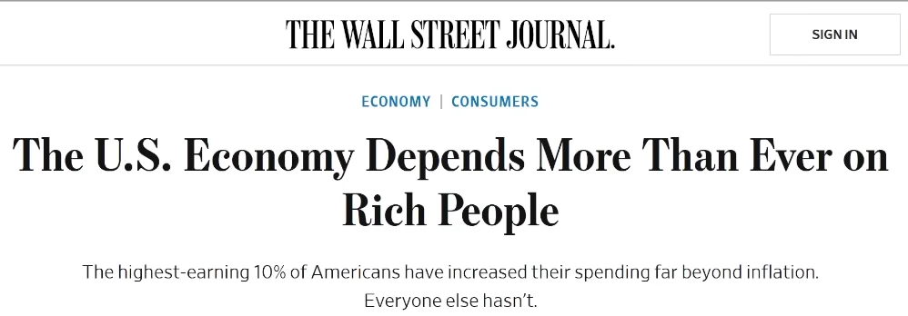

And what you really have in the US more and more is a bifurcated economy, a divided economy. You have the economy of the rich, which is financialized and dominated by big tech corporations, and it’s booming and looks like things are very healthy, but only a small percentage of elites benefit from that growth.

The vast majority of the population is not seeing economic growth. The real economy is stagnating for the majority of the population.

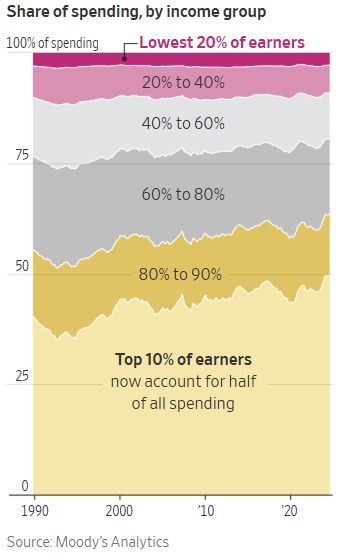

The Wall Street Journal published an important article that provided a glimpse into this titled, “The US economy depends more than ever on rich people.” It noted that the richest 10% of the American population now represents roughly half of all spending, 49.7% of all spending in the economy, which is a massive increase over the past three decades.

Thirty years ago, the richest 10% made up 36% of all spending. Now it’s nearly 50%. Moreover, spending by the richest 10% of Americans makes up one third of all US GDP, gross domestic product.

## Many US states already in recession

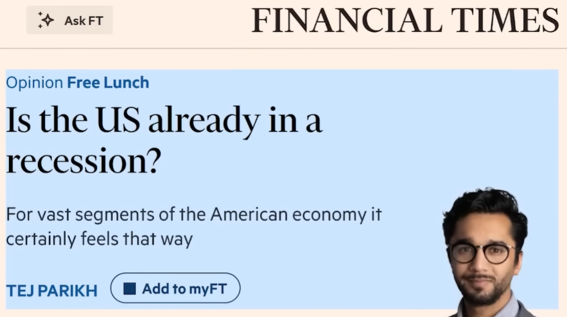

And this is why so many working-class Americans feel like they’re in a recession, because in their own local economies, in the real economy, they are in recession.

But the problem with GDP figures for a country is that they’re aggregate figures. They take GDP growth across the entire country. So for the United States, it looks like the US economy is growing because GDP is taken for all 50 states in the US, including states whose economies are dominated by rich elites.

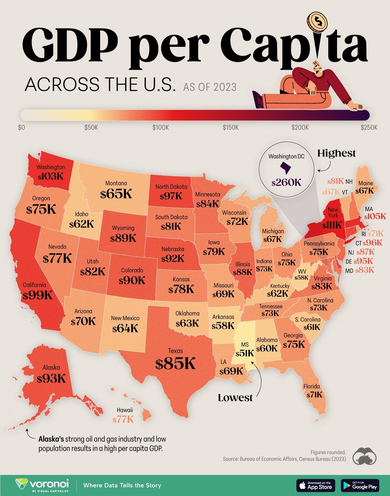

But even the Financial Times published an article acknowledging that the way a recession is measured in the US has problems. Now, a recession is officially declared when there are two consecutive fiscal quarters of negative GDP growth. But because that’s an aggregate figure, it can obscure the fact that a recession is actually happening in many parts of the country.

The Financial Times reported that “US states making up close to one third of the country’s GDP are either in or at high risk of recession.” And it noted this is especially the case for the Midwest and parts of the Rust Belt that have been de-industrialized as the US economy has financialized in recent decades.

But the people living in those states are forgotten because a few states like California, Texas, and New York do have their local economy growing, largely because of these big bubbles that I’ll be talking about today. So what’s increasingly clear is that in the US there is one economy for the rich and there is another economy for everyone else.

## Biggest stock market bubble in history

And that economy for the rich that seems to be booming depends almost entirely on two massive and interrelated bubbles. There is the bubble in the stock market, which is the largest bubble in US history, and there is a related bubble in the tech sector, in particular in artificial intelligence, the AI industry.

Both of these bubbles are linked together, but I’m going to start by looking at the massive stock market bubble in the US. If you look at something called the Buffett indicator, named after the billionaire investor Warren Buffett, this analyzes the market capitalization of all publicly traded stocks in the US and compares it to GDP, the size of the entire economy.

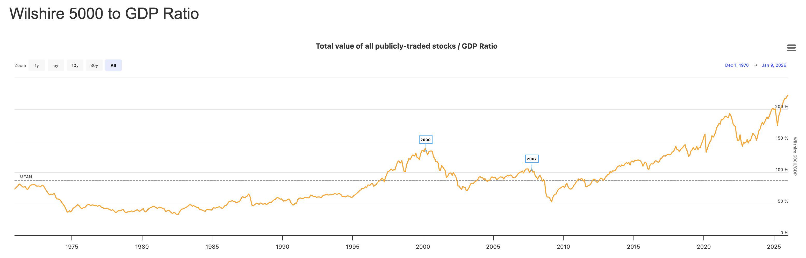

You can see that as of October 2025, it is now more than 219% of GDP. That is, the market capitalization, the market value of all of the stocks of publicly traded companies in the US combined, is more than two times greater than the size of the entire economy.

There has never been a moment in US history, for which we have data, when the bubble in the stock market has been this big. If you look back at the peak of the bubble in 2007, before it crashed in the 2008 and 2009 financial crisis, the Buffett indicator was “only” 105% of GDP.

Or if you look at the dot-com bubble back in the late 1990s, at the peak of the dot-com bubble in early 2000, the Buffett indicator was 138% of GDP. But today it is over 219% of GDP. This is the biggest bubble ever seen, at least for which we have data.

And yet this bubble keeps inflating and becoming bigger and bigger. Every few months in the US media, there’s another series of articles boasting about how the main US stock market index, the S&P 500, has reached record highs. And yet, the vast majority of the population is not benefiting from this growth in the stock market.

## 90% of stocks owned by 10% richest Americans

")

[Share of Corporate Equities and Mutual Fund Shares Held by the Top 1% (99th to 100th Wealth Percentiles)](https://fred.stlouisfed.org/series/WFRBST01122)

In fact, the richest 1% of Americans own 50% of all stocks in the US. And then when you add in the following richest 9% plus the 1% richest Americans together, the top 10 richest Americans hold over 87% of all stocks in the US. Nearly 90%. That figure has fluctuated around 90% for several years. Meanwhile, the bottom half of Americans, the poorest half of the country, only hold 1% of all stocks.

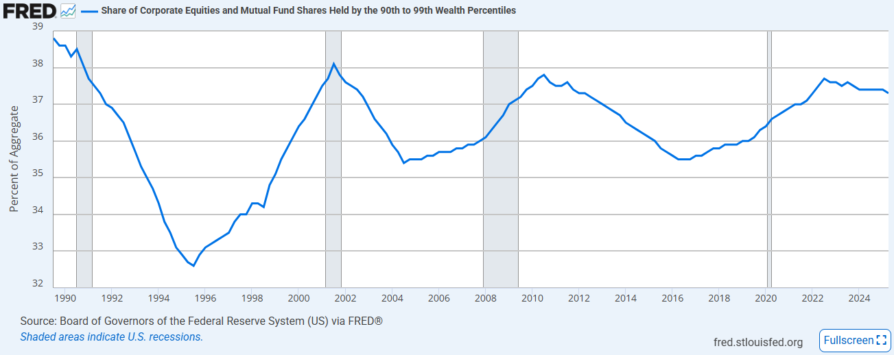

[Share of Corporate Equities and Mutual Fund Shares Held by the 90th to 99th Wealth Percentiles](https://fred.stlouisfed.org/series/WFRBSN09149)

1% for the bottom half of the country, whereas nearly 90% are held by the richest 10%. This is exactly why the Wall Street Journal reported that the US economy depends more than ever on rich people. This is why the richest 10% of Americans make up 50% of spending and one third of GDP because they have gotten very very rich as these massive bubbles have been inflated in the stock market. But the majority of the population has not benefited.

")

[Share of Corporate Equities and Mutual Fund Shares Held by the Bottom 50% (1st to 50th Wealth Percentiles)](https://fred.stlouisfed.org/series/WFRBSB50203)

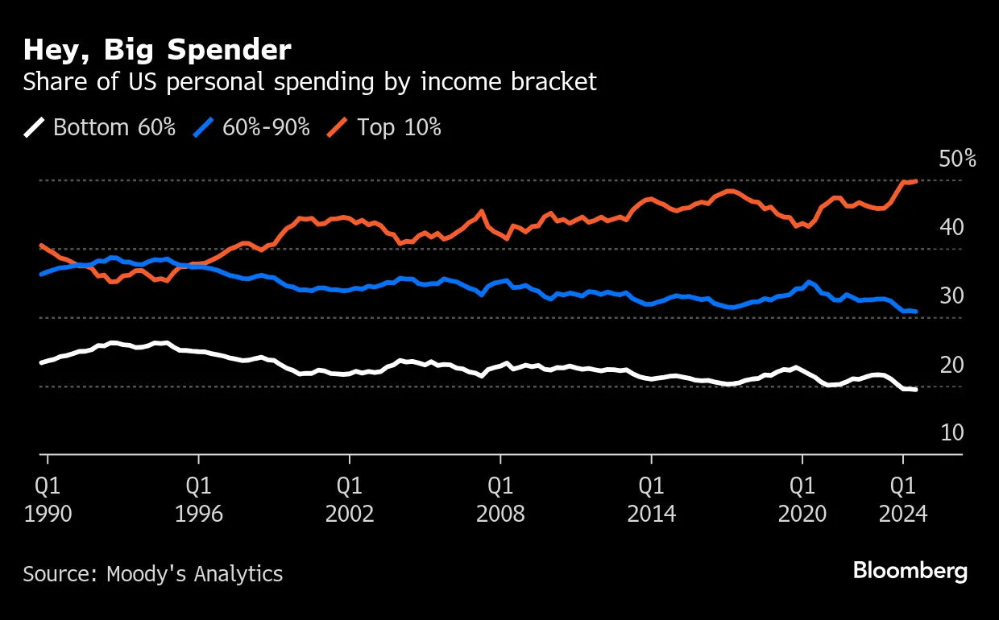

Meanwhile, if you read the financial press today, there are more and more articles that admit that the US economy is seeing large bubbles in the stock market and in the AI industry. But as the Financial Times put it in an article in August 2025, they're advising people on "How to invest in a stock market bubble".

Now, given how much the US economy depends on continuing to inflate this bubble in the stock market, what is especially concerning is how extremely concentrated this market is.

## Magnificent Seven (Mag7) Big Tech stocks

 Big Tech stocks")

 Big Tech stocks")

A small handful of corporations of big tech corporations are driving the vast majority of growth in the US stock market.
These big tech corporations have been referred to as the Magnificent 7 or the MAG 7. And in the first half of 2024, they grew by 31%. Whereas the rest of the S&P 500, the main US stock market index of the 500 largest publicly traded companies, was basically stagnant over the same time period. An analysis by a professor of finance at New York University named Aswath Demodaran found that the magnificent seven big tech monopolies make up 30.35% of the entire market capitalization of all of the publicly traded companies in the entire United States. That is 5,786 publicly traded companies.

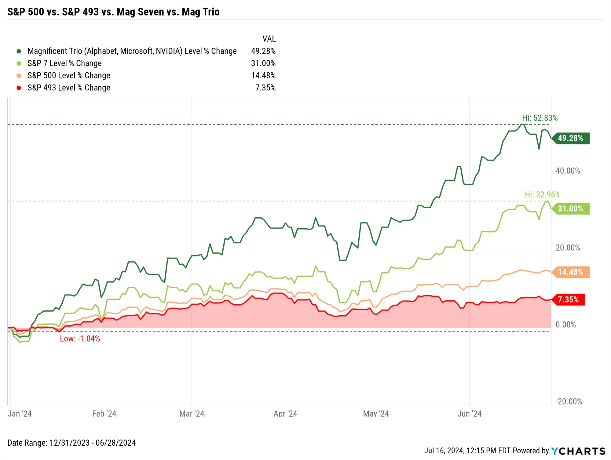

And yet just seven of those companies, representing 0.12% of the total number of companies, represented 30.35% of the entire market cap as of the end of September 2025. And what's even crazier is that the Magnificent 7 made up over half, that is 52.37%, of the growth in the market cap of the entire US stock market in the first 9 months of 2025. This is absolutely crazy. It is an unprecedented degree of concentration and it is also extremely risky.

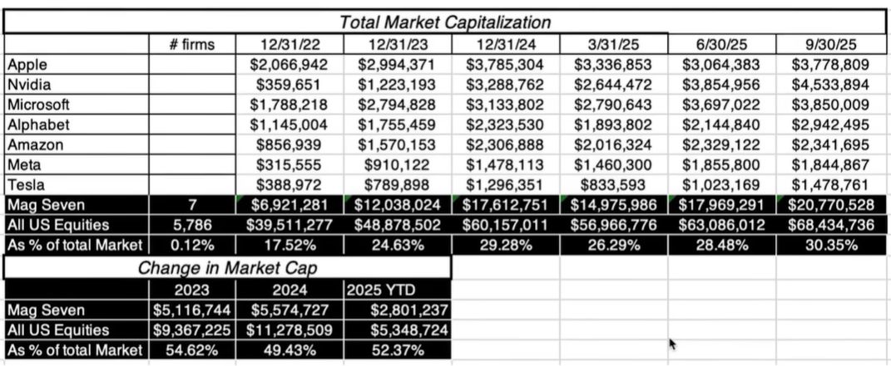

## Ten Titans Big Tech stocks

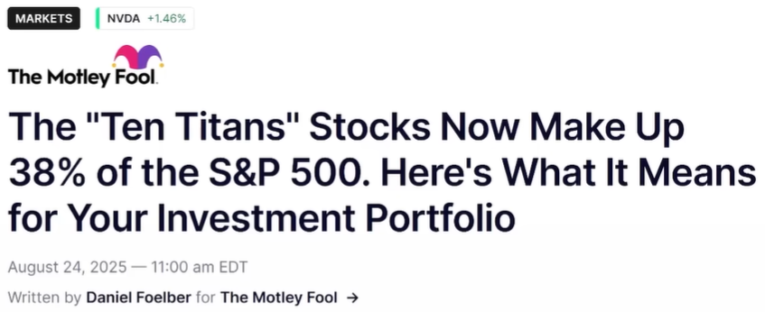

And in the last few years, there's been a lot of discussion in the financial press of the Magnificent 7, but that has since been slightly expanded to what are known as the 10 Titans. These are 10 big tech corporations that as of August 2025 made up 38% of the main stock market index, the S&P 500. That is nearly two-fifths in just 10 companies.

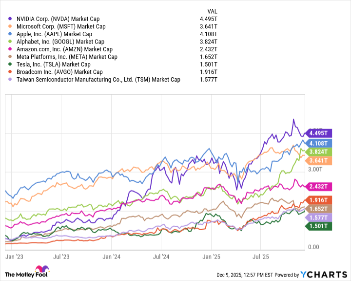

Those are Nvidia, Microsoft, Apple, Amazon, Alphabet, Meta, Broadcom, Tesla, Oracle, and Netflix. The stock price of these big tech corporations has been growing massively in recent years, whereas the rest of the S&P 500 has been largely stagnant.

## AI bubble

And a big reason for this is that many of these big tech corporations have been investing very heavily in artificial intelligence. And investors think that AI will totally transform the economy and the world. And they're investing all in so they can get as rich as possible.

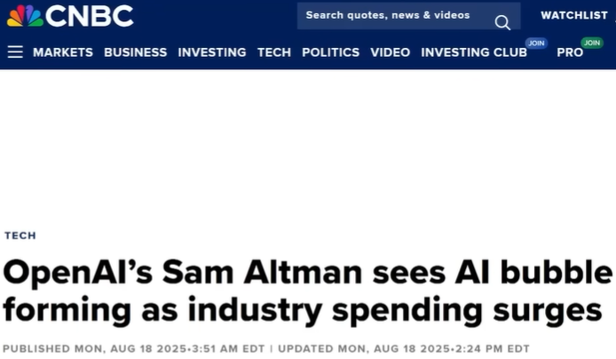

But there's a problem. The reality is that AI is in a huge bubble. And don't just take my word for it. One of the most powerful corporate executives in the US AI industry, Sam Altman, the CEO of Open AI, has come out publicly and admitted that AI is in a bubble. This is the head of the most influential AI company. Open AI runs ChatGPT and its CEO is saying that AI is in a big bubble.

This was also admitted by Jeff Bezos, the founder of Amazon, one of the richest billionaires on Earth. He was asked at a tech conference if he thought that AI is in a bubble. And he said yes, but he argued it's a good bubble because he claimed that supposedly AI is an industrial bubble as opposed to a financial bubble. I strongly disagree with that. As I will show today, it is not an industrial bubble. It is a financial bubble.

But Bezos claimed that this is a good bubble because supposedly the development of AI will benefit society. He didn't mention all of the people who will lose their jobs, which is only going to make the problem of inequality even worse as big tech billionaire oligarchs like him control more and more power in society because they own all of the AI technology.

Anyway, the point is, [listen to Bezos here admit that AI is in a bubble](https://www.youtube.com/shorts/ppy_toLPeqQ), but he claims it's a good bubble.

## (CLIP) Jeff Bezos: AI is in "good bubble"

What the stock market does, which is when we think of bubbles, we think of valuations and market caps and things like this. And how many billions of dollars are being invested in these six people at a $20 billion valuation even though they just started yesterday, right? That's very unusual behavior. Investors don't usually give a team of six people a couple of billion dollars with no product. It's rare and that's happening today.

But the great thing about industrial bubbles, this is a kind of industrial bubble as opposed to financial bubbles, and I'll tell you what I mean by that. If you go back, like the 90s had a biotech bubble and there were a bunch of pharma startup companies that were designing drugs and using new techniques and the world got very excited. The investment world got very excited as a group. They all lost money. But we did get a couple of life-saving drugs.

A bubble like a banking bubble, the crisis in the banking system, that's just bad. That's like 2008. And so those bubbles society wants to avoid. The ones that are industrial are not nearly as bad. It could even be good because when the dust settles and you see who are the winners, society benefits from those inventions. They still get those life-saving drugs. And that's what's going to happen here, too. This is real. The benefits to society from AI are going to be gigantic.

## 95% of AI pilot programs fail

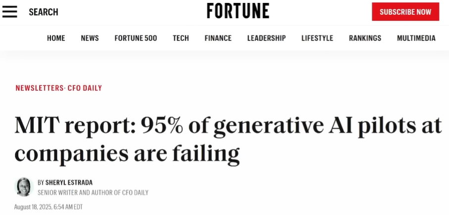

In fact, a report by scholars at MIT found that 95% of generative AI pilot programs at companies are failing. 95%. And even the projects that are not failing are making very little money. Most of these big tech companies that are investing hundreds of billions of dollars in AI still are not seeing significant returns, while the vast majority of the industry is failing.

## Investors keep buying overvalued stocks

And yet, what's incredible is investors continue to pile into these massively overvalued big tech stocks. This is how you really know you're in a bubble, when it's just mindless speculation that is fueling all of this. It's not based on value. Bloomberg published a shocking report titled, “Everyone says equities are overvalued, so they're piling in.” By the way, for people who don't know, equities is another way of saying stocks. It's ownership in a company.

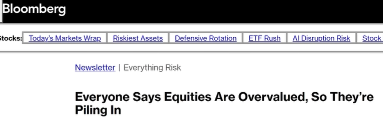

Bloomberg wrote that, quote, “We're in the unusual situation where fund managers almost uniformly say US stocks are overvalued, yet everyone is piling in.” This disconnect, as the S&P 500 index sets repeated all-time highs, is the market's biggest vulnerability going forward. End quote. This is the behavior of a bubble.

It published a chart that is shocking. It looks at a global fund manager survey that was done by Bank of America and it found that 91% of fund managers say that US equities are overvalued. 91%. And yet they continue to buy more and more, chasing returns. This is completely speculative, illogical behavior.

## Markets can remain irrational

It reminds me of the famous quote from the renowned economist John Maynard Keynes, who said markets can remain irrational longer than you can remain solvent. That's an important lesson. It's important to learn from history and past bubbles.

## Irrational exuberance

Back in 1996, the chair of the US Federal Reserve, the US central bank, Alan Greenspan, famously gave a speech in which he warned of quote “irrational exuberance” end quote. This was a way of saying that he saw the beginning of a bubble that was forming in the stock market.

## Dot-com bubble

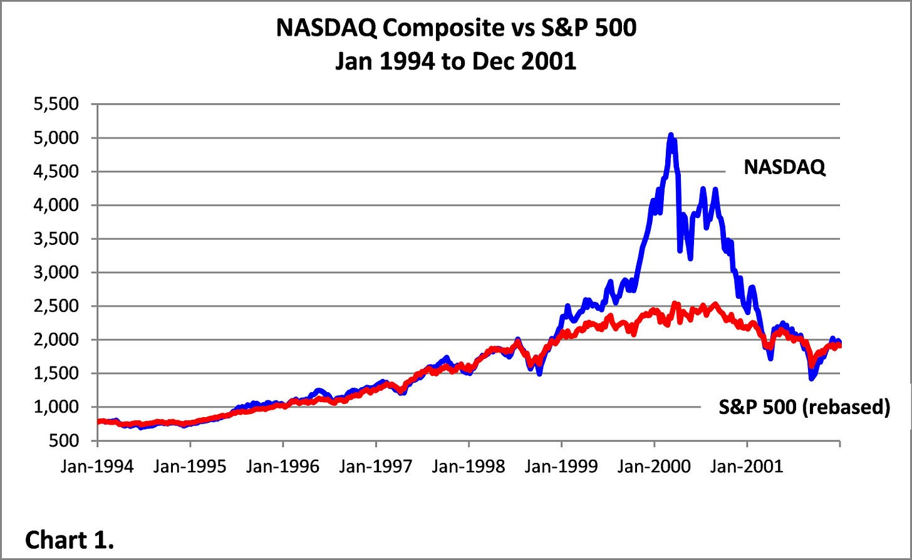

That was in December 1996, but that was in fact the beginning of what became known as the dot-com bubble, which was very similar to the bubble that we see today. It was driven by speculative tech stocks in companies that were often not returning a profit. It was driven by a speculative frenzy in tech stocks, and it peaked at the beginning of 2000.

So for more than three years after Alan Greenspan gave his irrational exuberance speech, the irrational stock market hysteria only grew further and further. And today in 2025, it looks so similar to what happened then.

## US share of global stock markets

As of the beginning of 2024, the US stock market made up more than 60% of the total market capitalization of all of the stock markets in the entire world. This is absolutely crazy. Mainland China's stock market, as of early 2024, made up less than 3% of the global stock market.

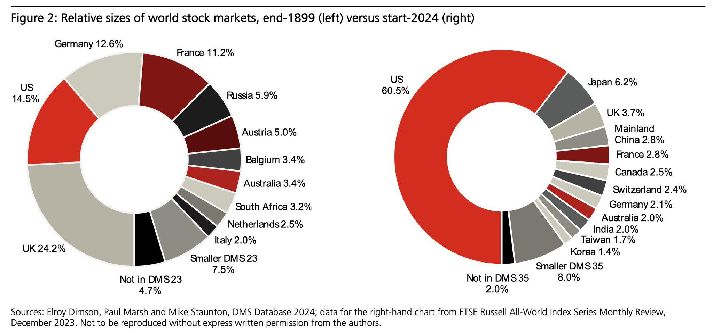

And yet, China's economy is much bigger than the US economy. If you measure GDP at purchasing power parity, China is nearly 20%, about 19.7%, of the global economy, whereas the US is less than 15%, about 14.75%, and shrinking over time. And yet, the US represents over 60% of the global stock market and mainland China represents less than 3%.

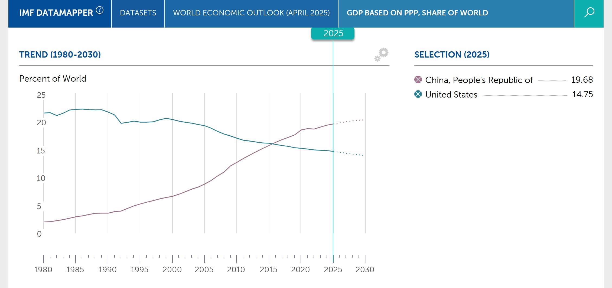

This just shows how financialized the US economy is and how the real economy is completely different from the big stock market bubble.

## US vs Chinese tech company revenue

If you compare the revenue of major Chinese tech companies to US tech companies, you can see that in many cases they have very similar levels of revenue. So Meta is one of the biggest companies on Earth. Meta is the owner of Facebook, Instagram, and WhatsApp.

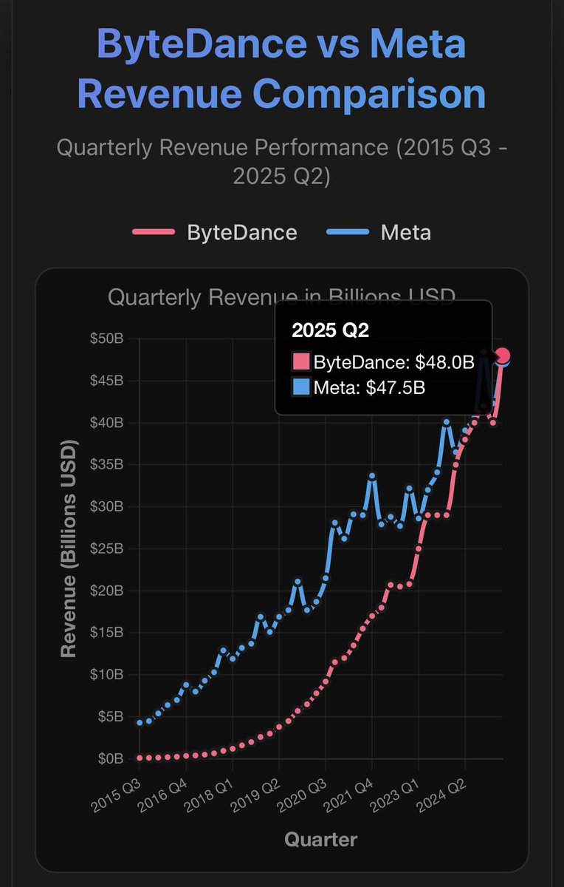

And yet, China's tech company ByteDance, which is the owner of TikTok, ByteDance's revenue, as of the second quarter of 2025, was larger than Meta's revenue. So these Chinese big tech companies are as large as US big tech companies in terms of revenue, but their market capitalization is a tiny fraction of the market cap of US big tech corporations.

So for context, Meta's market cap as of July 2025 was 1.88 trillion, nearly two trillion.

## Tesla vs global automotive industry

One of the clearest examples of the enormous bubble in the US tech industry is to compare the market cap of Tesla to other major car manufacturers around the world. Tesla's market cap as of the end of 2024 was $1.44 trillion.

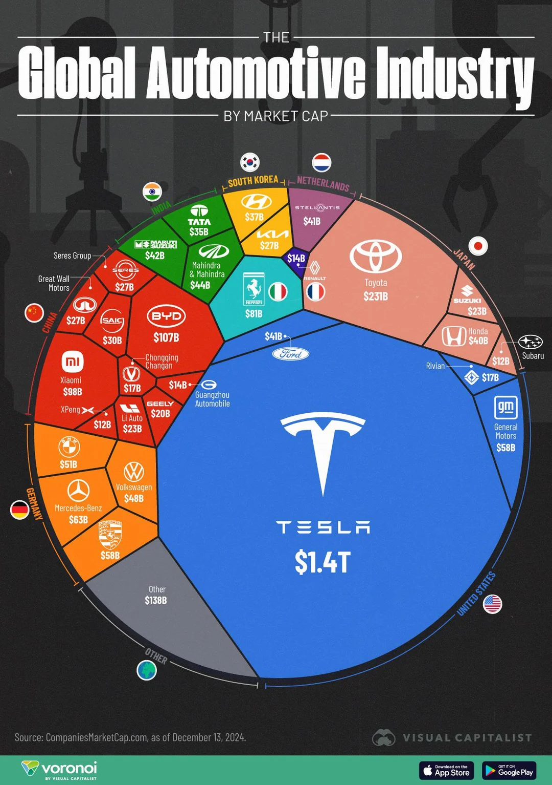

Now, keep in mind that Tesla's stock has been pretty volatile, especially given Elon Musk's involvement in politics. But as of the end of 2024, Tesla represented nearly half of the entire world's market capitalization for the global automotive industry.

Compare that to the Chinese company BYD, whose market cap was only $117 billion as of the end of 2024, which meant that it was about one thirteenth of Tesla's market cap at that time. Yet BYD is now the world's largest manufacturer of electric vehicles, EVs, when you look at its revenue, not at its market cap, not at the price of its stock. BYD in 2024 had higher revenue than Tesla. And yet Tesla's market cap was 13 times BYD's.

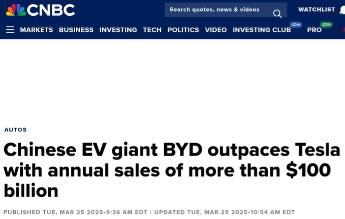

What's even crazier is if you look at the actual number of cars that Tesla sells compared to its market capitalization. This just gives you the perfect visualization of the enormous bubble in the US stock market, which is completely irrational. In 2024, Tesla sold 1.8 million cars. BYD sold 4.3 million cars.

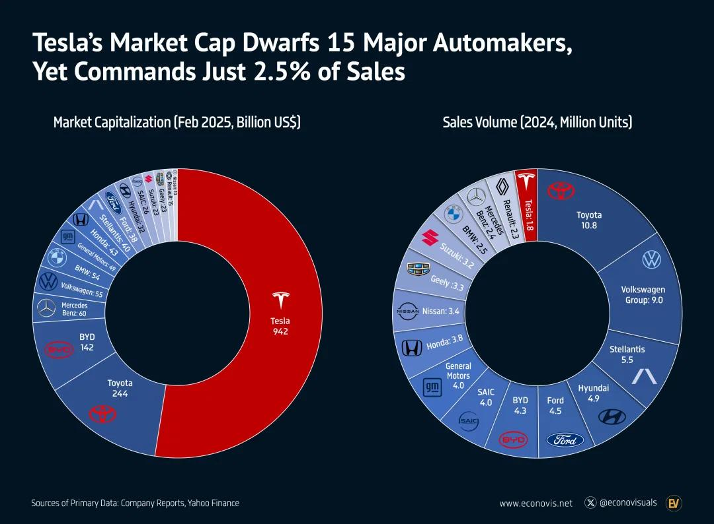

And yet, Tesla's market capitalization as of February 2025, despite the fact that it had shrunk significantly from $1.4 trillion at the end of 2024, was larger than 15 major automakers combined, including Toyota, BYD, Mercedes-Benz, Volkswagen, BMW, General Motors, Honda, Stellantis, Ford, Hyundai, SAIC, Suzuki, Renault, and Nissan. All of their market caps combined were still smaller than Tesla's. This is an absolutely insane, irrational bubble.

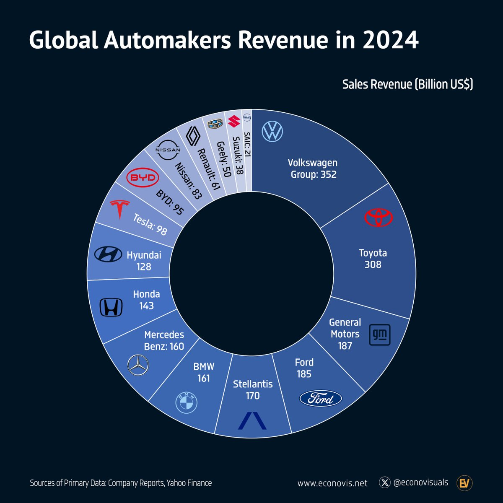

## Top 10 US stocks: 16% global market cap

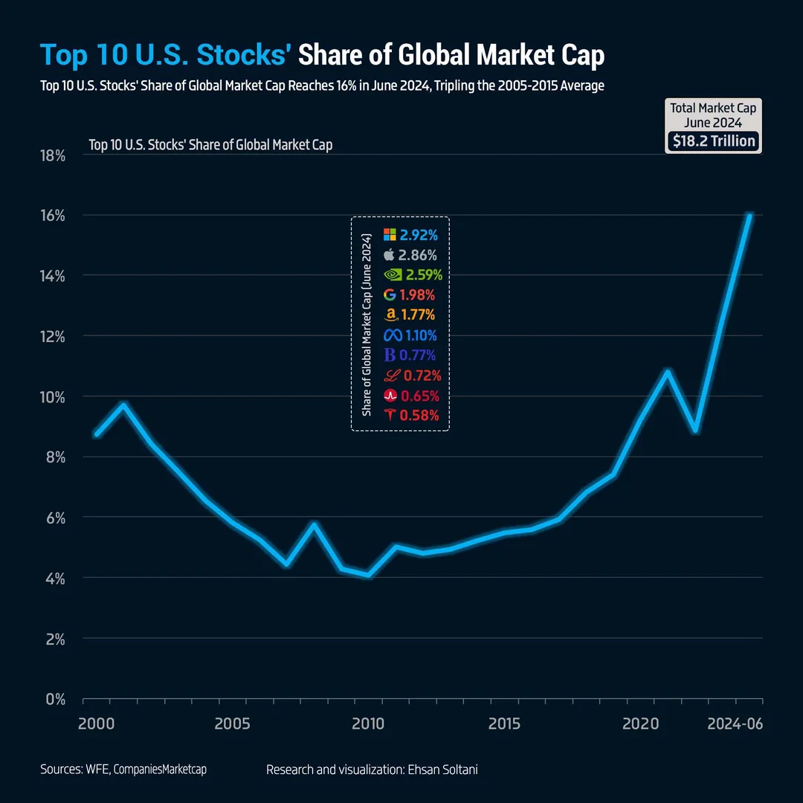

As of June 2024, the top 10 US stocks, which were almost all big tech corporations, made up 16% of the entire world's market capitalization of all of the stock markets in the world. And this bubble only continues to inflate.

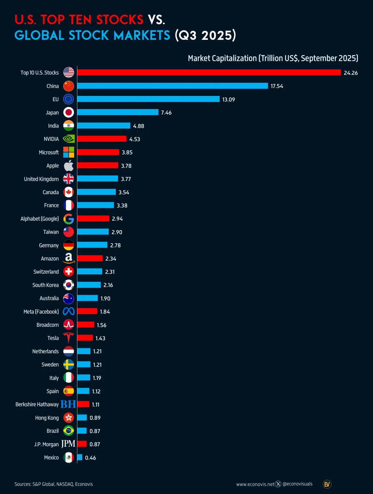

## Recession

I need to emphasize that this is why so many people around the world look at the US economy and think that it's so healthy and so strong and growth is high. But that growth is concentrated in a few sectors. It is a financial bubble, and if that bubble pops it can cause serious damage not only to the US economy but to the entire world.

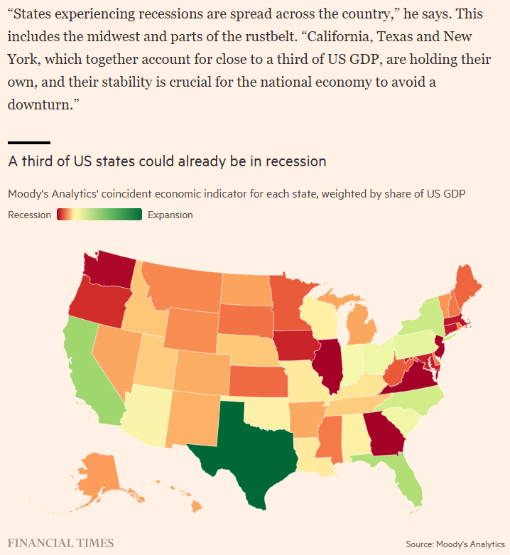

Because the reality is if you look past the US stock market bubble and the AI bubble, you can see that the real economy that average working people engage with every single day is very likely in recession. There are more and more reports warning of recession in the US. And for a lot of people who are not in Silicon Valley and Wall Street, especially in the Rust Belt in the Midwest in the US, they have been in recession.

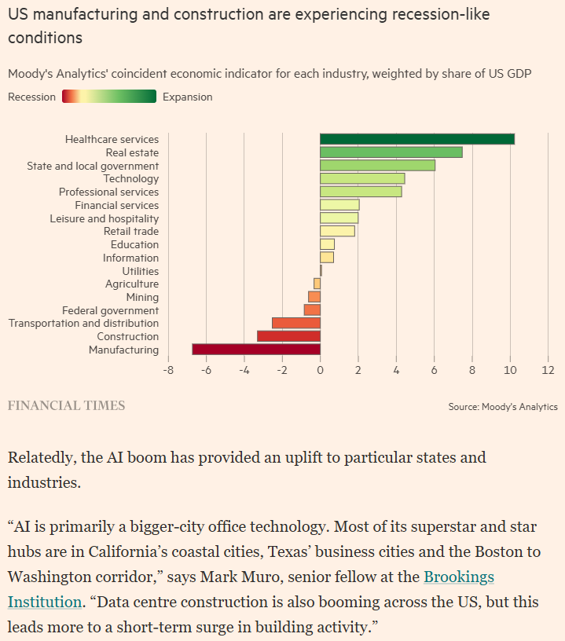

Earlier I mentioned the article in the Financial Times that reported that US states making up close to one third of GDP are either already in recession or are at high risk of recession. This is what is dismissively referred to as flyover country. But there are tens of millions of people who are living in a recession in their local economy, in the real economy.

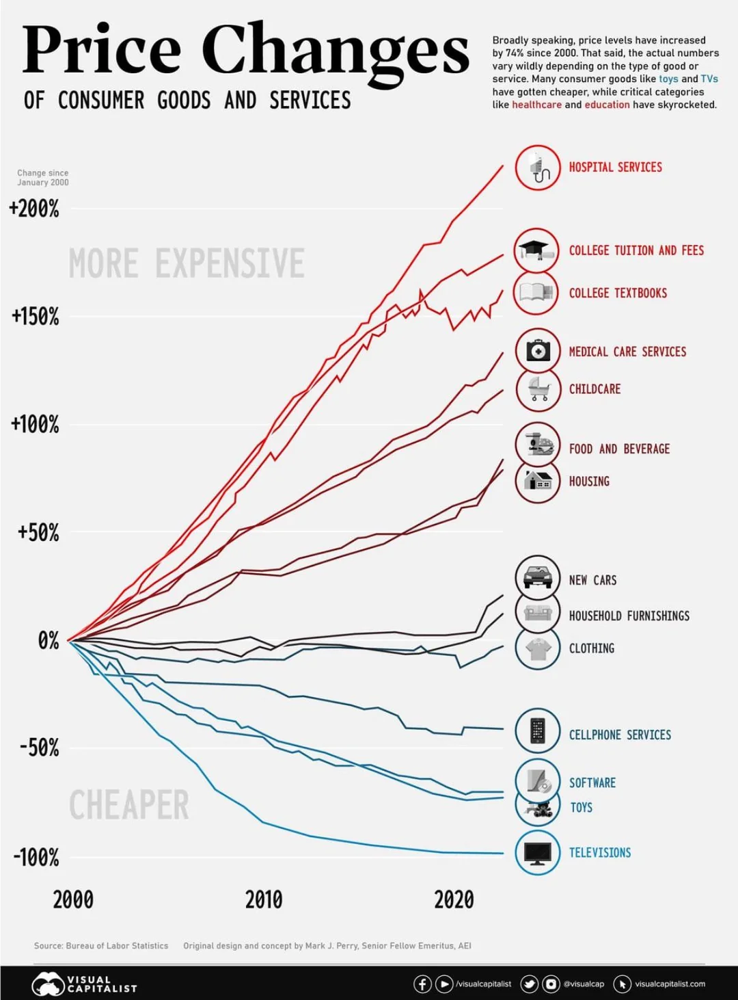

## Stagflation

And yet inflation has been running very hot coming out of the supply chain disruptions at the end of the pandemic, and also as the US, for geopolitical reasons, is waging a trade war and a tech war on China, one of its largest trading partners, and the US is trying to decouple from China.

China was a major source of deflation in the US, exporting very cheap consumer goods to the US. Well, now the US has stubbornly high rates of inflation. Trump's tariffs are going to only make inflation worse. So more and more economists are warning of stagflation, that is simultaneous economic stagnation and inflation like the US saw in the 1970s.

## AI capex contribution to US GDP growth

And we're already seeing reports warning of stagnation and recession while the AI bubble continues to inflate. Imagine what would happen if the AI bubble popped. In fact, Fortune reported that AI spending is adding 0.5% to GDP growth. So it's not an exaggeration at all to say that the AI bubble is really keeping the US economy afloat.

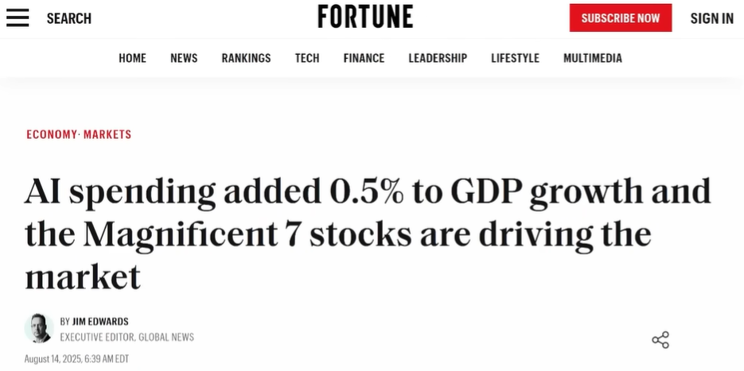

Real GDP in the US is only expected to grow between 1.5% and 1.6% in 2025. So if AI spending is responsible for 0.5%, that means that one third of the growth in the US economy is coming from AI, and even that could be a major understatement.

The Harvard University economist Jason Furman, who's a very mainstream economist, and who previously served as the chair of economic advisers for former US President Obama, pointed out on Twitter that investment in information processing equipment and software only represents 4% of US GDP, but it was responsible for 92% of GDP growth in the first half of 2025.

Of course, not all of this, but much of this investment in information processing equipment and software is AI capital expenditure, AI capex. So this could be evidence that AI represents over 90% of growth in US GDP so far in 2025.

This Harvard economist pointed out that if you exclude this spending from US GDP growth, the other parts of the US economy only grew at 0.1% in aggregate. That is to say, this could be evidence that if you exclude artificial intelligence capex, the US economy is in stagnation, if not full-on recession.

## AI is eating the economy

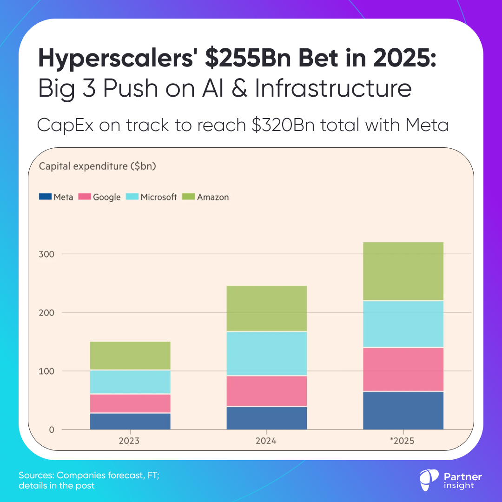

This is why more and more American financial analysts are repeating the phrase AI is eating the economy. The capex, that is the capital expenditure of US AI companies building these massive data centers, represents 1.2% of US GDP. Big tech corporations are literally spending hundreds of billions of dollars every year on capex to build these massive AI data centers to train AI models and to operate these huge AI programs that are used by billions of people.

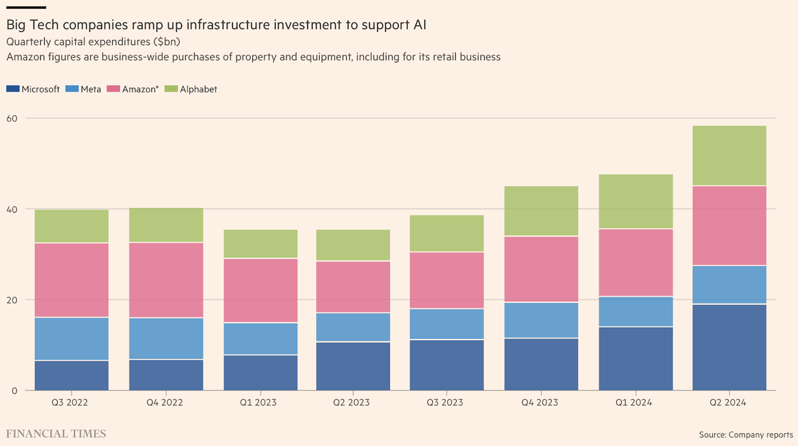

In 2025, just four big tech companies in the US are expected to spend more than $300 billion on AI investment. That includes Amazon, Microsoft, Google, and Meta. $300 billion in one year. That is absolutely crazy.

## AI drives up electricity bills

And when analysts say that AI is eating the US economy, it's not an exaggeration because one of the impacts of this massive capex by big tech corporations is that they are gobbling up electricity. And the cost of electricity in the US has been soaring largely due to AI companies.

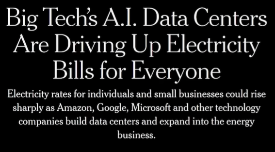

If you look at the average price of electricity per kilowatt hour in the US, according to data from the Federal Reserve, you can see that during the pandemic in 2020 it was 13 cents per kilowatt hour. And yet, starting in 2022 with the AI investment boom, it massively increased. And as of June 2025, it's now 19 cents per kilowatt hour. And this is only going to get worse over time, not better.

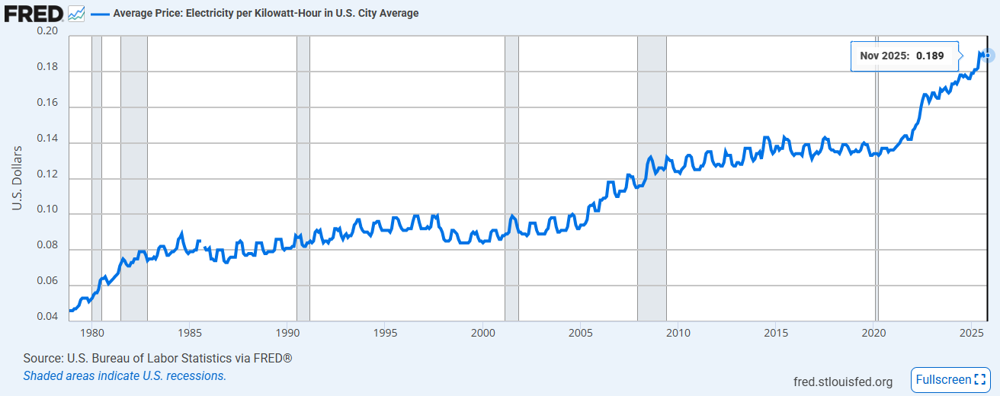

[Average Price: Electricity per Kilowatt-Hour in U.S. City Average](https://fred.stlouisfed.org/series/APU000072610)

## Trump shuts down renewable energy

As electricity costs in the US are soaring, the US government should be helping to invest in creating more electricity and more energy. The Trump administration is doing the exact opposite because Trump hates renewable energy and Trump is very close to the fossil fuel industry, and he's helping his billionaire corporate executive friends and shareholders who have invested in big oil and gas corporations.

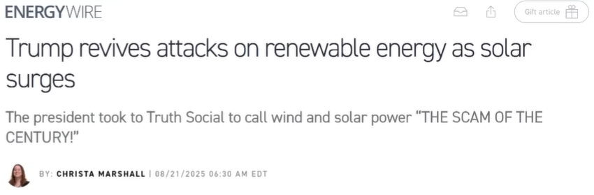

So the Trump administration is actually trying to shut down large solar and wind power projects to prevent renewable energy from going onto the grid to benefit fossil fuel corporations, which is reducing the availability of electricity in the US right at the time when big tech corporations are gobbling up more and more. This is an absolutely crazy policy.

So again, I need to emphasize that when financial analysts say that AI is eating the US economy, it's not an exaggeration.

## AI adds more to GDP than shopping

Fortune published a very important article in August titled spending on AI data centers is so massive that it's taken a bigger chunk of GDP growth than shopping and it could crash the American economy. The US economy has for a long time been driven by massive levels of consumption. But listen to this. This is crazy.

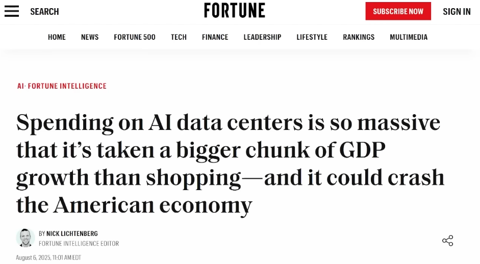

I'm reading here from Fortune magazine. Quote, “Giant tech companies have spent so much on data centers in 2025 that their spending is now contributing more to US economic growth than consumer spending, long considered the nation's economic engine.” End quote.

They then warned that quote, “A ton of money is flowing into one concentrated area and the outcome of that is uncertain.” End quote. When the AI bubble pops, and believe me, eventually it will pop, this is going to cause very significant damage to the entire US economy.

## US job growth collapses

And again, the reality is that even as this AI bubble continues to inflate, for many average working people in the US the economy is not in a good situation. They are seeing a recession in the real economy. You can see this if you look at the data on the job market.

NPR warned that cracks are showing in the US economy, and as of the data published in September 2025, job growth in the US has slowed by 75% compared to the previous year. The US Bureau of Labor Statistics, the BLS, published data in September that showed that the US created 911,000 fewer jobs, nearly a million fewer jobs, through March 2025 than were initially reported.

And this is extremely ironic because Trump fired the chief of the Bureau of Labor Statistics because he falsely claimed that the BLS data was politicized to hurt him. And yet, after Trump fired the supposedly biased BLS chief, the newest BLS data showed the number of jobs shrinking further, not rising, which is the exact opposite of what Trump claimed.

Trump argued without any evidence that the BLS chief he fired was undercounting the number of jobs and that actually the economy was booming. But after he fired the Bureau of Labor Statistics chief, they reduced the number of jobs even further. So this is not because of bias. This is because in reality the real economy in the US is in recession for average working people, despite the bubbles in the stock market and in big tech.

In fact, if you look more closely at the data, you can see that there is basically no job growth or there is negative job growth in most sectors of the US economy. One of the only sectors of the US job market that has been doing well in recent years, other than AI, is the health care industry.

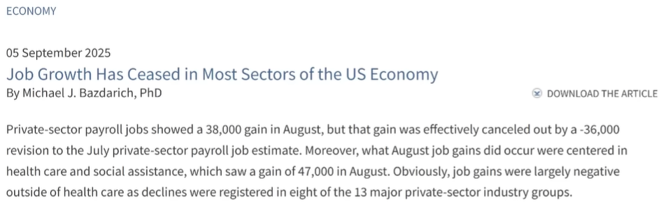

And this is because the US privatized, for-profit health industry is extremely bloated. It wastes so much money on red tape and forcing people to jump through so many hoops. People pay massive out-of-pocket expenses even when they have insurance, because the hospital they went to was out of network, or they pay massive premiums and yet the insurance companies do not want to actually pay what they should pay. It is basically a scam, the US health insurance industry.

Then add to those problems the fact that the population in the US is aging. There are more and more elderly people and retirees who are entering nursing homes and they need more health care. So that is another major reason that there are more and more jobs available in the health care sector. But it is not because the US economy is healthy.

In fact, if you look at the data for 2024, two thirds of all of the jobs created in the US were either in private education and health services or government. So these are the massively inefficient, bloated, privatized, for-profit education industry in the US, where students are spending $60,000 a year on tuition, or the extremely expensive, bloated, privatized health insurance industry. These are not productive sectors that are making people's lives better. In fact, in many ways, they are making people's lives worse.

## Bifurcated economy

So this is the reality of the US economy. Increasingly, what you have is two separate economies. You have the economy of the rich, which is indeed booming and things look good because of these bubbles that are unsustainable. And then you have the economy for everyone else, for the poor and working class, for the majority of the population, and they are in recession.

The real US economy is in recession, but it looks like overall, in aggregate, the US economy is growing. But it is not. It is because of an illusion. It is because of bubbles driven by AI, by big tech, by the stock market. And when those bubbles pop, because every bubble eventually pops, it is a matter of inevitability, the rest of the economy is going to suffer even more.
